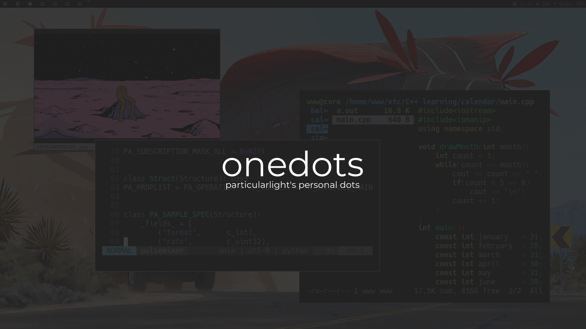

# onedots

## about
* shell - zsh
* editor - neovim
* file manager - ranger
    * mounting - udisks2 with udiskie
* browser - firefox
* video - mpv
* images - sxiv
* window manager - dwm
    * notification manager - dunst
    * bar - slstatus
* fonts - terminus, hack, siji icons
